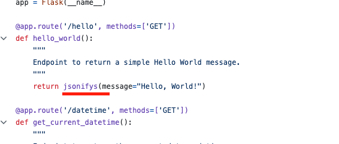
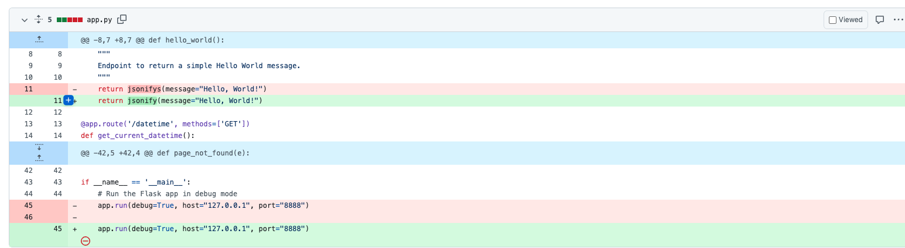
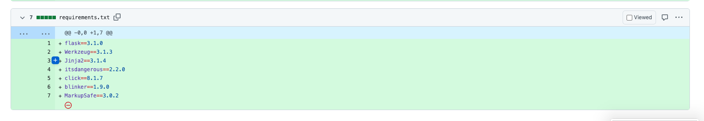
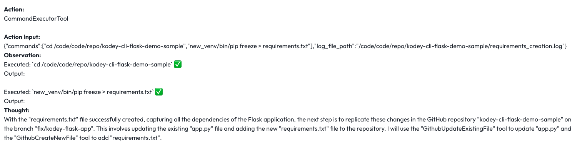

# Kodey CLI Flask Project Sample Walkthrough

This repository serves as a demo for showcasing how Kodey.ai can troubleshoot and resolve issues within a Flask application using a command-driven workflow.

## Objectives

In this sample, Kodey.ai will identify a syntax error (use of `Jsonifys` instead of `Jsonify`) in the Flask application and correct it. Additionally, Kodey will run the app to detect any missing dependencies and generate a `requirements.txt` file to include these dependencies for the project.

## Project Setup & Steps

1. Sign up for or log in to your Kodey.ai account (link-here).
2. Configure your Kodey.ai integrations with your chosen issue tracker and cloud Git provider.
3. Fork this repository and clone it into your cloud Git provider (e.g., GitHub, Azure DevOps, Bitbucket).
4. Ensure a `dev` branch exists, as Kodey will create new branches from `dev`.
5. Create a sample issue or work item in your issue tracker, using the description provided below.
6. Execute the provided prompt in Kodey.ai's chat UI.
7. Validate the resulting commits and pull requests in your cloud Git provider.

## Sample Prompt - Flask Application with Missing Dependencies and Syntax Error
```
    platform: github

    repository-to-work-on: kodey-cli-flask-demo-sample

    branch name to create: fix/kodey-flask-app

    programming-language-used: python

    Information to agent: Do as the steps below are defined one by one. You are working in github repo so make sure to use tools related to github repo.

    NOTE: You should write the actual implementation of code not just comments. You are working on testing the flask application project and fix if there are any issues. You first need to work locally and then when everything is working fine as mentioned by steps, you then need to make changes in the github repo at last. Change can be updating the existing file or adding new files.

    Perform the steps below one by one:

    step 1: Create a new branch with name <branch name to create> and then do the steps below.

    step 2: Using repo cloner tool, Clone the repository.

    step-3: Using command executioner tool, Please read the content of the file using cat command and understand what are the endpoints available before doing anythig.

    step-2: Using command executioner tool,  Create a new virtual environment named new_venv in the same location where the repo was cloned.

    step-3: Then activate that virtual environment .After that run app.py script to let the flask app come live. You need to run the application in the background saving logs in a log file which will be later used to see how the application is performing.

    step-4: Using the feedback reader tool, read the log file and check if the flask app is running and working correctly. If you see any error there,
    understand what the issue is and purpose a solution for it.

    step-5: Fix every issue that you see while running the application, and With the solution from step-4 using command executor tool, update the code file to fix that issue and do a recheck of the application.

    step-6: Repeat the step-5 until there is no more issue.

    step-7: If everything is fine and application is running correctly , also add a requirements.txt file to have all the packages used.

    step-8: Once everything is done upto step-7, make same changes to files and new files in the github as well.

    step 9: Finally make a pull request with appropriate title from above branch to the main branch.

    step 10: Update this jira issue status to DONE.
```

## Sample Thought Process done by kodey

1. **Environment Setup**: After creating `new_venv`, i activate it, and then use `CommandExecutorTool` to run `app.py` in the background while capturing logs.
2. **Dependency Installation**: When `ModuleNotFoundError` for Flask is identified, i used `CommandExecutorTool` to install Flask and any other missing packages.
3. **Application Re-run**: After installing dependencies, i rerun `app.py` to ensure it’s running without errors and check the logs.
4. **Generate Requirements**: I create `requirements.txt` by freezing the installed packages in `new_venv`.
5. **Finalizing Changes**: I Update `app.py` and add `requirements.txt` in the GitHub repository under the `fix/kodey-flask-app` branch.

## Confirming Successful Completion

1. Verify that the new branch (`fix/kodey-flask-app`) has been created.
2. Check that the pull request includes changes to `app.py` and the new `requirements.txt`.
3. Confirm the issue is marked as DONE in the issue tracker.

By following these steps, Kodey.ai demonstrates the ability to autonomously troubleshoot, modify, and update a Flask project.

---

## Screenshots

- **Intentional Error in Code (`Jsonifys` instead of `Jsonify`):**

  

- **Fix for the Error:**

  

- **Generated `requirements.txt` File:**

  

- **Kodey Executing Commands:**

  
